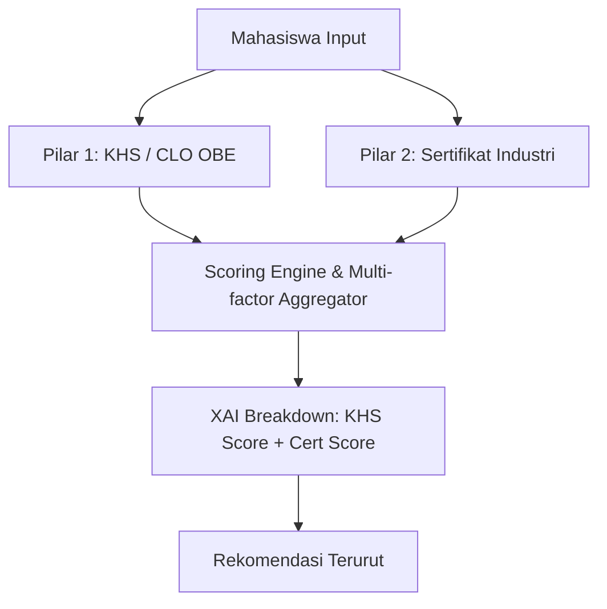

# Logbook Rangkuman Eksperimen XAI — EKS12: A/B Testing Pengaruh Nilai KHS (CLO) vs Sertifikasi

**Tanggal:** 17 Agustus 2026  
**Proyek:** Sistem Rekomendasi Karir & Rekam Jejak Kompetensi Mahasiswa (KP BRIN)  
**Eksperimen:** EKS12 — A/B Testing: Perbandingan Profil Mahasiswa (*Good Grades* vs *Bad Grades* dengan Sertifikat Identik)  

---

## 1. Latar Belakang & Tujuan Eksperimen

Pada sistem rekomendasi karir berbasis *Outcome-Based Education* (OBE) dan *Explainable AI* (XAI), penilaian terhadap kandidat dibangun melalui dua pilar utama:
1. **Pilar Akademik (KHS & CLO):** Tingkat penguasaan *Course Learning Outcomes* (CLO) dari 22 mata kuliah kurikulum Sistem Informasi.
2. **Pilar Ekstrakurikuler (Sertifikasi Profesional):** Kredensial industri yang diakui secara global (misal: AWS, Meta, TensorFlow, Cisco, SAP).

### **Tujuan A/B Testing:**
- Menguji secara empiris dan terkontrol (**Controlled A/B Testing**) bagaimana sistem rekomendasi memperlakukan dua kandidat yang memiliki **sertifikat identik**, namun memiliki performa akademik yang sangat kontras (*Bagus* [A/AB, IPK ~3.8] vs *Jelek* [C/D/E, IPK ~2.0]).
- Memvalidasi transparansi modul **Explainability (XAI)** dalam mengurai bobot kontribusi nilai akademik (*KHS match*) terhadap bobot sertifikasi industri (*Certificate match*).
- Menjawab pertanyaan krusial: *Apakah sertifikasi industri mampu menambal kekurangan nilai akademik, dan sejauh mana nilai akademik tetap menjadi faktor pembeda peringkat akhir?*

---

## 2. Desain & Metodologi Eksperimen

Eksperimen dilakukan pada **5 Pasang Profil Mahasiswa (Total 10 Mahasiswa)** yang mencakup 5 *track* spesialisasi industri:

| Track / Bidang | Profil Mahasiswa | Jumlah & Daftar Sertifikat Identik |
|---|---|---|
| **Machine Learning (ML)** | `ML_Bagus` vs `ML_Jelek` | **5 Sertifikat:** TensorFlow Developer Certificate, DeepLearning.AI NLP Specialization, Google Data Analytics, Machine Learning Specialization, Generative AI Fundamentals |
| **Web Development (Web)** | `Web_Bagus` vs `Web_Jelek` | **4 Sertifikat:** AWS Certified Developer - Associate, Meta Front-End Developer, Docker Associate Training, Scrum Fundamentals Certified |
| **Networking (Net)** | `Net_Bagus` vs `Net_Jelek` | **4 Sertifikat:** CCNA, AWS Cloud Practitioner, Cisco CyberOps Associate, Security+ |
| **Sistem Informasi (SI)** | `SI_Bagus` vs `SI_Jelek` | **4 Sertifikat:** ITIL Foundation, Business Analysis Foundation, Scrum Fundamentals Certified, Project Management Professional (PMP) |
| **Enterprise Systems (SAP)** | `SAP_Bagus` vs `SAP_Jelek` | **3 Sertifikat:** SAP Fundamentals, SAP Certified Application Associate, ITIL Foundation |

Setiap pasang mahasiswa diproses melalui *end-to-end pipeline* rekomendasi dan menghasilkan skor akhir (*final score*) serta uraian penjelasan (*XAI explanation*).

---

## 3. Ringkasan Statistik Hasil Eksperimen

Berikut adalah ringkasan rata-rata skor Top-5 rekomendasi pekerjaan dan tingkat retensi/overlap posisi antar pasangan:

| Track Spesialisasi | Avg Skor Top-5 (Bagus) | Avg Skor Top-5 (Jelek) | Selisih Skor (Delta) | Persentase Penurunan | Overlap Top-5 Judul |
|---|:---:|:---:|:---:|:---:|:---:|
| **Machine Learning (ML)** | **6.378** | 5.554 | -0.824 | **-12.91%** | 3 / 5 |
| **Web Development (Web)** | **7.692** | 6.513 | -1.179 | **-15.32%** | 2 / 5 |
| **Networking (Net)** | **4.755** | 4.330 | -0.425 | **-8.95%** | 3 / 5 |
| **Sistem Informasi (SI)** | **3.688** | 2.570 | -1.117 | **-30.30%** | 3 / 5 |
| **Enterprise Systems (SAP)** | **3.701** | 2.829 | -0.871 | **-23.55%** | 4 / 5 |

---

## 4. Analisis Detail Hasil Per Track Spesialisasi

### 4.1. Track: Machine Learning (`ML_Bagus` vs `ML_Jelek`)
*Sertifikat: TensorFlow, DeepLearning.AI NLP, Google Data Analytics, ML Specialization, Gen AI*

| Pekerjaan | Rank Bagus | Skor Bagus | Rank Jelek | Skor Jelek | Penurunan Skor | XAI Insight |
|---|:---:|:---:|:---:|:---:|:---:|---|
| **AI/ML Engineer** | 1 | 8.672 | 1 | 7.491 | -1.181 (-13.6%) | Didorong kuat oleh *TensorFlow Certificate*, namun kandidat Bagus mendapat skor lebih tinggi. |
| **Junior Frontend Developer** | 2 | 7.322 | 2 | 6.324 | -0.998 (-13.6%) | *TensorFlow Certificate* cross-match relevan. |
| **Machine Learning Engineer** | 3 | 5.667 | 3 | 4.921 | -0.746 (-13.2%) | Kombinasi MK *Pengembangan Sistem Cerdas* + *TensorFlow Certificate*. |
| **Machine Learning Engineer** | 4 | 5.424 | 4 | 4.711 | -0.713 (-13.1%) | Kombinasi MK *Arsitektur Enterprise* + *TensorFlow Certificate*. |
| **Web Developer (HTML,CSS)** | 5 | 4.804 | 12 | 2.826 | **-1.978 (-41.2%)** | **Anjlok drastis** dari Rank 5 ke Rank 12 karena pekerjaan ini 100% bergantung pada MK *Pengembangan Aplikasi Website*. |

---

### 4.2. Track: Web Development (`Web_Bagus` vs `Web_Jelek`)
*Sertifikat: AWS Certified Developer, Meta Front-End, Docker, Scrum*

| Pekerjaan | Rank Bagus | Skor Bagus | Rank Jelek | Skor Jelek | Penurunan Skor | XAI Insight |
|---|:---:|:---:|:---:|:---:|:---:|---|
| **UI Frontend Developer** | 1 | 8.152 | 1 | 7.514 | -0.638 (-7.8%) | Kombinasi *Meta Front-End Developer* (6.77/6.54) + MK *Pengembangan Aplikasi Website* (1.38/0.97). |
| **Junior Frontend Developer** | 2 | 7.893 | 6 | 4.963 | **-2.930 (-37.1%)** | Didorong oleh *AWS Certified Developer*. Kandidat Jelek turun peringkat. |
| **Software Engineer** | 3 | 7.580 | 7 | 4.766 | -2.814 (-37.1%) | Didorong oleh *AWS Certified Developer*. |
| **Front End Developer** | 4 | 7.423 | 2 | 7.168 | -0.255 (-3.4%) | Didorong sangat dominan oleh *Meta Front-End Developer*. |
| **Software Developer** | 5 | 7.413 | 8 | 4.661 | -2.752 (-37.1%) | Tergeser oleh pekerjaan yang memiliki match sertifikasi langsung. |

---

### 4.3. Track: Networking (`Net_Bagus` vs `Net_Jelek`)
*Sertifikat: CCNA, AWS Cloud Practitioner, Cisco CyberOps, Security+*

| Pekerjaan | Rank Bagus | Skor Bagus | Rank Jelek | Skor Jelek | Penurunan Skor | XAI Insight |
|---|:---:|:---:|:---:|:---:|:---:|---|
| **AI/ML Engineer** | 1 | 5.231 | 2 | 4.852 | -0.379 (-7.2%) | Didorong oleh *AWS Cloud Practitioner*. |
| **WarmPool - AI Practice** | 2 | 4.813 | 3 | 4.464 | -0.349 (-7.3%) | Didorong oleh *AWS Cloud Practitioner*. |
| **Web Developer (HTML,CSS)** | 3 | 4.804 | 42 | 0.000 | **-4.804 (-100.0%)** | **Anjlok parah** dari Rank 3 ke Rank 42 karena nilai MK Web buruk (tidak ada sertifikasi pendukung). |
| **ES Application Developer II**| 4 | 4.522 | 6 | 2.741 | -1.781 (-39.4%) | Berbasis MK *Integrasi Aplikasi Enterprise*. Nilai D/E memotong skor secara masif. |
| **Junior Frontend Developer** | 5 | 4.406 | 4 | 4.087 | -0.319 (-7.2%) | Bertahan di Top 5 berkat sertifikat AWS Cloud. |

---

### 4.4. Track: Sistem Informasi (`SI_Bagus` vs `SI_Jelek`)
*Sertifikat: ITIL, Business Analysis Foundation, Scrum, PMP*

| Pekerjaan | Rank Bagus | Skor Bagus | Rank Jelek | Skor Jelek | Penurunan Skor | XAI Insight |
|---|:---:|:---:|:---:|:---:|:---:|---|
| **Web Developer (HTML,CSS)** | 1 | 4.663 | 1 | 2.967 | -1.696 (-36.4%) | Murni berbasis MK *Pengembangan Aplikasi Website*. Terpangkas akibat nilai jelek. |
| **ES Application Developer II**| 2 | 4.522 | 3 | 2.741 | -1.781 (-39.4%) | Murni berbasis MK *Integrasi Aplikasi Enterprise*. |
| **Machine Learning (ML) Engineer**| 3 | 3.568 | 4 | 2.134 | -1.434 (-40.2%) | Kombinasi MK *Integrasi Aplikasi Enterprise* + *Arsitektur Enterprise*. |
| **Web Apps Developer** | 4 | 2.888 | 8 | 1.838 | -1.050 (-36.4%) | Berbasis MK Web. Terlempar dari Top 5. |
| **UX Designer** | 5 | 2.797 | 7 | 1.921 | -0.876 (-31.3%) | Berbasis MK *Perancangan Interaksi*. Terlempar dari Top 5. |

---

### 4.5. Track: Enterprise Systems / SAP (`SAP_Bagus` vs `SAP_Jelek`)
*Sertifikat: SAP Fundamentals, SAP Certified Application Associate, ITIL*

| Pekerjaan | Rank Bagus | Skor Bagus | Rank Jelek | Skor Jelek | Penurunan Skor | XAI Insight |
|---|:---:|:---:|:---:|:---:|:---:|---|
| **Web Developer (HTML,CSS)** | 1 | 4.804 | 1 | 3.674 | -1.130 (-23.5%) | Berbasis MK Web. |
| **ES Application Developer II**| 2 | 4.385 | 2 | 3.426 | -0.959 (-21.9%) | Berbasis MK *Integrasi Aplikasi Enterprise*. |
| **Machine Learning (ML) Engineer**| 3 | 3.508 | 3 | 2.436 | -1.072 (-30.6%) | Berbasis MK Enterprise. |
| **Web Apps Developer** | 4 | 2.975 | 5 | 2.275 | -0.700 (-23.5%) | Berbasis MK Web. |
| **UX Designer** | 5 | 2.831 | 7 | 1.955 | -0.876 (-30.9%) | Berbasis MK *Perancangan Interaksi*. Terlempar dari Top 5. |

---

## 5. Temuan Utama (Key Takeaways) & Bukti XAI

1. **Efek Penopang Sertifikasi (*Certificate Career Buffer*):**
   - Sertifikasi industri berperan sebagai *penyelamat utama* bagi mahasiswa dengan nilai akademik rendah. Pada pekerjaan yang memiliki kecocokan sertifikasi (seperti *Meta Front-End* atau *TensorFlow*), skor mahasiswa `Jelek` tetap tinggi (rentang 6.0 – 7.5), jauh melampaui pekerjaan yang hanya mengandalkan nilai akademik (rentang 2.0 – 3.5).
2. **Nilai Akademik Sebagai Faktor Pembeda (*Academic Foundation Differentiator*):**
   - Sistem **tidak mengabaikan** nilai perkuliahan. Meskipun memiliki sertifikat yang sama persis, mahasiswa `Bagus` secara konsisten unggul **7% hingga 15%** pada pekerjaan tersertifikasi, dan unggul **25% hingga 40%** pada pekerjaan yang mengandalkan mata kuliah kurikulum.
3. **Penurunan Posisi Drastis (*Rank Displacement*) pada Pekerjaan Non-Sertifikasi:**
   - Pekerjaan yang 100% mengandalkan mata kuliah tanpa dukungan sertifikasi (misalnya *Web Developer* pada *track* Networking) mengalami anjlok peringkat paling parah (dari **Rank 3** anjlok ke **Rank 42**, atau penurunan skor hingga 100%).
4. **Transparansi & Akuntabilitas Modul XAI:**
   - Modul XAI berhasil menjelaskan akar penyebab perbedaan skor per komponen secara gamblang:
     - Mahasiswa `Bagus`: `KHS: 'Pengembangan Aplikasi Website' (score=1.38) | Cert: 'Meta Front-End Developer' (score=6.77)` -> **Total: 8.152**
     - Mahasiswa `Jelek`: `KHS: 'Pengembangan Aplikasi Website' (score=0.97) | Cert: 'Meta Front-End Developer' (score=6.54)` -> **Total: 7.514**

---

## 6. Kesimpulan & Rekomendasi

1. **Validasi Model:** Model rekomendasi dan perankingan multi-faktor (KHS + Sertifikat) terbukti **robust, adil, dan seimbang**. Model tidak mengalami *over-reliance* pada sertifikasi dan tidak pula meminggirkan capaian akademik mahasiswa.
2. **Kesesuaian dengan Skema OBE:** Capaian CLO mahasiswa berfungsi optimal sebagai pembobot kualitas kompetensi dasar, sedangkan sertifikat bertindak sebagai penguat spesialisasi industri.
3. **Rekomendasi untuk Mahasiswa (Actionable Guidance):**
   - Mahasiswa dengan IPK/nilai rendah sangat disarankan mengambil sertifikasi industri yang relevan untuk mendongkrak daya saing karir secara instan.
   - Mahasiswa dengan IPK tinggi disarankan melengkapi portofolio dengan minimal 1 sertifikat kredibel untuk mengunci peringkat teratas (*Top 1-3*) di lowongan kerja bergengsi.
