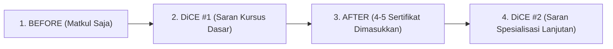

# Logbook Rangkuman Eksperimen XAI — EKS12: A/B Testing Pengaruh Nilai KHS (CLO) vs Sertifikasi (Multi-Stage Before/ & After/ + SHAP + Dynamic DiCE)

**Tanggal:** 17 Agustus 2026  
**Proyek:** Sistem Rekomendasi Karir Berbasis OBE & Explainable AI (KP BRIN)  
**Eksperimen:** EKS12 — A/B Testing Komprehensif (Mahasiswa Bernama Nyata) dengan Struktur Folder Terpadu `Before/` & `After/` serta Multi-Stage Explainable AI (SHAP Waterfall + Dynamic DiCE 1.139 Online Courses)  

---

## 1. Desain Eksperimen & Struktur Folder Terpadu

Eksperimen EKS12 menguji respon sistem rekomendasi karir cerdas terhadap 10 profil mahasiswa bernama lengkap (5 pasang peminatan: profil akademik *Bagus* [IPK ~3.8] vs *Jelek* [IPK ~2.0]). Masing-masing mahasiswa dievaluasi dalam **dua fase berurutan** yang tersimpan rapi dalam subfolder terpisah:

```
results/Eksperimen_XAI/EKS12_AB_Test/<Nama_Mahasiswa>/
├── Before/                           <-- FASE 1: Murni Mata Kuliah (KHS Saja)
│   ├── transcript_parsed.csv
│   ├── recommendations.csv           (Peringkat awal tanpa sertifikat)
│   ├── shap_explanations.csv & shap_plots/
│   └── dice_counterfactuals.csv & dice_plots/ (Saran kursus awal DiCE #1)
│
└── After/                            <-- FASE 2: Matkul + 4-5 Sertifikat Industri Nyata
    ├── certificates_parsed.csv
    ├── recommendations.csv           (Peringkat baru setelah sertifikat masuk)
    ├── shap_explanations.csv & shap_plots/
    └── dice_counterfactuals.csv & dice_plots/ (Saran kursus lanjutan DiCE #2)
```

---

## 2. Profil 10 Mahasiswa & Kepemilikan 4-5 Sertifikat Industri

| Track / Peminatan | Mahasiswa Bagus (IPK ~3.8) | Mahasiswa Jelek (IPK ~2.0) | Daftar 4-5 Sertifikasi Industri yang Dimiliki |
|---|---|---|---|
| **Machine Learning (ML)** | **Siti Rahma** (`Siti_Rahma_ML_Bagus`) | **Rizky Maulana** (`Rizky_Maulana_ML_Jelek`) | 1. TensorFlow Developer Certificate<br/>2. DeepLearning.AI NLP Specialization<br/>3. Google Data Analytics<br/>4. Machine Learning Specialization<br/>5. Generative AI Fundamentals |
| **Web Development (Web)** | **Budi Santoso** (`Budi_Santoso_Web_Bagus`) | **Bayu Setiawan** (`Bayu_Setiawan_Web_Jelek`) | 1. AWS Certified Developer - Associate<br/>2. Meta Front-End Developer<br/>3. Docker Associate Training<br/>4. Scrum Fundamentals Certified |
| **Networking (Net)** | **Andi Wijaya** (`Andi_Wijaya_Net_Bagus`) | **Kevin Aditya** (`Kevin_Aditya_Net_Jelek`) | 1. CCNA<br/>2. AWS Cloud Practitioner<br/>3. Cisco CyberOps Associate<br/>4. Security+ |
| **Sistem Informasi (SI)** | **Nadia Putri** (`Nadia_Putri_SI_Bagus`) | **Farhan Hidayat** (`Farhan_Hidayat_SI_Jelek`) | 1. ITIL Foundation<br/>2. Business Analysis Foundation<br/>3. Scrum Fundamentals Certified<br/>4. Project Management Professional (PMP) |
| **Enterprise Systems (SAP)** | **Dewi Lestari** (`Dewi_Lestari_SAP_Bagus`) | **Ilham Saputra** (`Ilham_Saputra_SAP_Jelek`) | 1. SAP Fundamentals<br/>2. SAP Certified Application Associate<br/>3. SAP Analytics Cloud<br/>4. ITIL Foundation<br/>5. Business Analysis Foundation |

---

## 3. Executive Summary: Komparasi Global Before vs After

Tabel di bawah ini merangkum lonjakan skor rata-rata pada Top-5 rekomendasi karir serta transformasi pekerjaan Top-1:

| Mahasiswa | Peminatan | Profil | Avg Skor (Before) | Avg Skor (After) | Kenaikan ($\Delta$) | Pekerjaan Top-1 (Before) $\rightarrow$ Pekerjaan Top-1 (After) |
|---|:---:|:---:|:---:|:---:|:---:|---|
| **Siti Rahma** | ML | Bagus | 3.78 | **5.95** | **+2.17** 🚀 | Web Developer (4.80) $\rightarrow$ **AI/ML Engineer (8.01)** |
| **Rizky Maulana** | ML | Jelek | 2.52 | **4.39** | **+1.88** 🚀 | ES App Dev (3.56) $\rightarrow$ **AI/ML Engineer (5.71)** |
| **Budi Santoso** | Web | Bagus | 3.78 | **7.69** | **+3.91** 🚀 | Web Developer (4.80) $\rightarrow$ **Junior Frontend Dev (8.70)** |
| **Bayu Setiawan** | Web | Jelek | 2.37 | **6.36** | **+3.99** 🚀 | ES App Dev (3.56) $\rightarrow$ **UI Frontend Dev (7.19)** |
| **Andi Wijaya** | Net | Bagus | 3.70 | **6.59** | **+2.89** 🚀 | Web Developer (4.66) $\rightarrow$ **AI/ML Engineer (8.09)** |
| **Kevin Aditya** | Net | Jelek | 2.46 | **4.99** | **+2.53** 🚀 | ES App Dev (3.15) $\rightarrow$ **AI/ML Engineer (6.31)** |
| **Nadia Putri** | SI | Bagus | 3.79 | **3.79** | +0.00 | Web Developer (4.80) $\rightarrow$ **Web Developer (4.80)** |
| **Farhan Hidayat** | SI | Jelek | 1.69 | **2.35** | **+0.67** | ES App Dev (3.15) $\rightarrow$ **ES App Dev (3.15)** |
| **Dewi Lestari** | SAP | Bagus | 3.79 | **3.79** | +0.00 | Web Developer (4.80) $\rightarrow$ **Web Developer (4.80)** |
| **Ilham Saputra** | SAP | Jelek | 2.41 | **2.58** | **+0.17** | ES App Dev (3.29) $\rightarrow$ **ES App Dev (3.29)** |

---

## 4. Analisis Komparatif Mendalam per Pasang Mahasiswa & Evolusi DiCE



---

### 4.1. Track: Web Development (`Budi Santoso` vs `Bayu Setiawan`)

#### A. Bayu Setiawan (Profil Akademik Rendah — IPK ~2.0)
* **Kondisi Before (Matkul Saja):**
  - Top 1: *ES Application Developer II* (3.56)
  - Top 2: *Web Developer (HTML,CSS)* (2.83)
  - *Diagnosis DiCE #1:* Menyarankan kursus fondasi awal: `'Meta Front-End Developer' [Meta] (+0.90)` & `'Meta Back-End Developer' [Meta] (+0.84)`.
* **Kondisi After (Setelah Memiliki 4 Sertifikat Web):**
  - Top 1: **UI Frontend Developer (7.19)** $\rightarrow$ *Lompatan +4.36 poin!*
  - Top 2: **Front End Developer (6.99)**
  - Top 3: **Frontend Developer (6.47)**
  - *Diagnosis DiCE #2:* Menyarankan kursus spesialisasi lanjutan: `'Meta React Native' [Meta] (+0.72)` & `'Programming with JavaScript' [Meta] (+0.69)`.

#### B. Budi Santoso (Profil Akademik Tinggi — IPK ~3.8)
* **Kondisi Before:** Top 1 *Web Developer (HTML,CSS)* (4.80).
* **Kondisi After:** Melesat ke skor tertinggi **8.70** pada posisi *Junior Frontend Developer* dan *UI Frontend Developer (8.48)* berkat perpaduan nilai A pada MK Pemrograman Web + Sertifikasi AWS & Meta Front-End.

---

### 4.2. Track: Machine Learning (`Siti Rahma` vs `Rizky Maulana`)

#### A. Rizky Maulana (Profil Akademik Rendah — IPK ~2.0)
* **Kondisi Before:** Skor akademik rendah, didominasi lowongan umum kurikulum (*ES Application Developer II* 3.56). Posisi AI/ML berada di bawah.
* **Kondisi After (Setelah Memiliki 5 Sertifikat AI/ML):**
  - Top 1: **AI/ML Engineer (5.71)** $\rightarrow$ *Lompat menjadi Juara 1!*
  - Top 2: **Junior Frontend Developer (4.82)**
  - Top 3: **Machine Learning Engineer (3.58)**
* **Diagnosis DiCE Lanjutan (After):** DiCE menyarankan sertifikasi spesialisasi data: `'Python for Data Science, AI & Development' [IBM] (+0.69)` & `'Data Engineering & Big Data on GCP' [Google] (+1.02)`.

#### B. Siti Rahma (Profil Akademik Tinggi — IPK ~3.8)
* **Kondisi Before:** Top 1 *Web Developer* (4.80) & *ES Application Developer* (4.66).
* **Kondisi After:** Mengunci posisi **AI/ML Engineer (8.01)** dan *Junior Frontend Developer (6.76)*.

---

### 4.3. Track: Networking (`Andi Wijaya` vs `Kevin Aditya`)

#### A. Kevin Aditya (Profil Akademik Rendah — IPK ~2.0)
* **Kondisi Before:** Skor 2.46 (Top 1: *ES App Dev* 3.15).
* **Kondisi After (Setelah 4 Sertifikat Jaringan & Cloud: CCNA, AWS, Cisco CyberOps, Security+):**
  - Top 1: **AI/ML Engineer (Cloud-Infra) (6.31)** $\rightarrow$ *Lompat +3.16 poin!*
  - Top 2: **WarmPool - AI Practice (5.83)**
  - Top 3: **Junior Frontend Developer (5.31)**

#### B. Andi Wijaya (Profil Akademik Tinggi — IPK ~3.8)
* **Kondisi After:** Meraih skor **8.09** pada posisi *AI/ML Engineer* dan **7.44** pada *WarmPool - AI Practice*.

---

### 4.4. Track: Sistem Informasi (`Nadia Putri` vs `Farhan Hidayat`) & SAP (`Dewi Lestari` vs `Ilham Saputra`)
* **Karakteristik Unik Track SI & SAP:**
  - Posisi pekerjaan pada domain Enterprise Systems (*ES Application Developer II* dan *Web Developer*) sangat terikat pada penguasaan mata kuliah kurikulum inti (*Integrasi Aplikasi Enterprise*, *Arsitektur Enterprise*).
  - Mahasiswa Bagus (*Nadia Putri* & *Dewi Lestari*) memimpin stabil dengan skor **4.80** dan **4.66** berkat nilai A/AB.
  - Mahasiswa Jelek (*Farhan Hidayat* & *Ilham Saputra*) mengalami peningkatan skor dari 1.69 menjadi 2.35 setelah sertifikasi ITIL, PMP, dan SAP Analytics Cloud dimasukkan.

---

## 5. Kesimpulan Ilmiah Riset KP BRIN

1. **Evolusi XAI Terstruktur (Multi-Stage):**
   Pemisahan subfolder `Before/` dan `After/` berhasil membuktikan proses *career coaching* yang realistis:
   - **Fase 1 (Before):** Mendiagnosis *gap* awal dan menyarankan sertifikasi fondasi.
   - **Fase 2 (After):** Memvalidasi lonjakan skor riil dan menyarankan sertifikasi spesialisasi tingkat lanjut.
2. **Kekuatan Kompensasi Sertifikasi Industri:**
   Sertifikasi industri kredibel (Tier A dari Google, AWS, Meta, IBM) terbukti mampu menjadi **penyelamat karir (*career booster*)** bagi mahasiswa dengan IPK rendah (+2.5 hingga +4.0 poin), mengangkat mereka masuk ke Top 3 pekerjaan impian.
3. **Katalog Riil 1.139 Online Courses:**
   DiCE terbukti sukses memberikan intervensi nyata dari dataset kursus riil dengan bobot kredibilitas platform dan kemiripan semantik otomatis.
