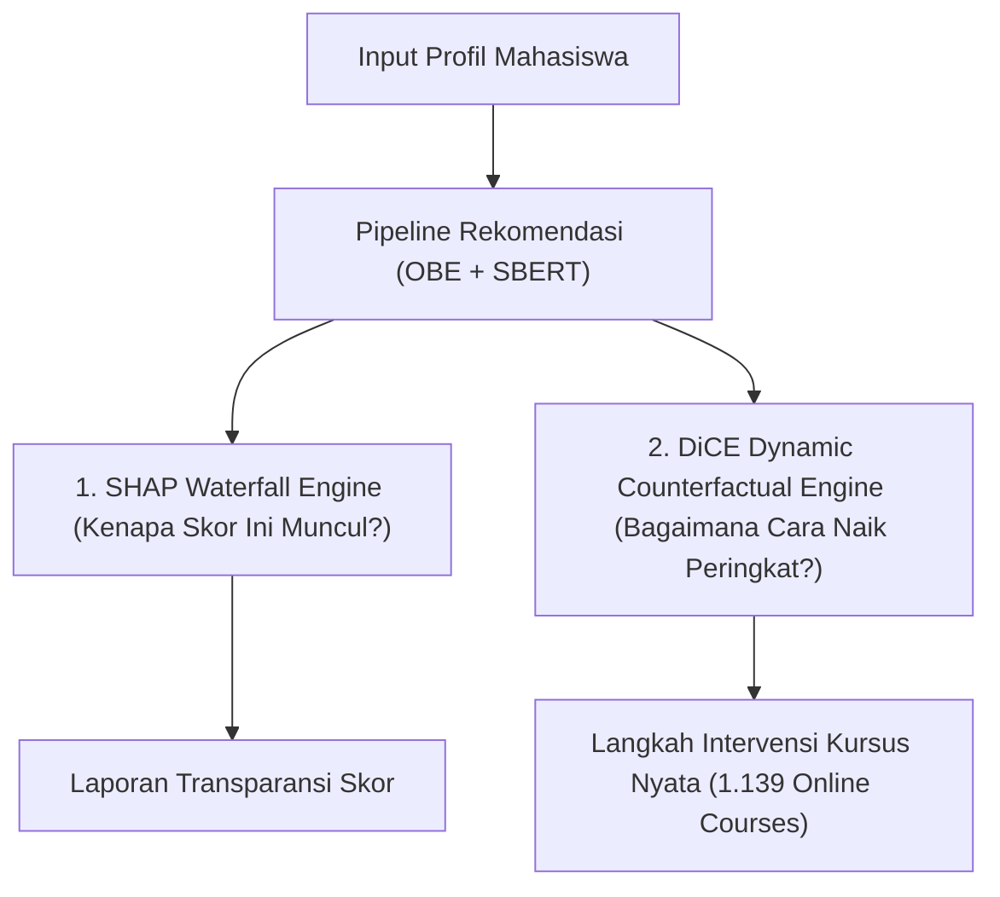

# Logbook Rangkuman Eksperimen XAI — EKS12: A/B Testing Pengaruh Nilai KHS (CLO) vs Sertifikasi (SHAP Waterfall + Dynamic DiCE Counterfactuals)

**Tanggal:** 17 Agustus 2026  
**Proyek:** Sistem Rekomendasi Karir Berbasis OBE & Explainable AI (KP BRIN)  
**Eksperimen:** EKS12 — A/B Testing Komprehensif (Mahasiswa Bernama Nyata) + Dual-Engine XAI (SHAP Local Feature Attribution & Dynamic DiCE 1.139 Online Courses)  

---

## 1. Latar Belakang & Desain Eksperimen

Eksperimen EKS12 menggabungkan seluruh kapabilitas rekomendasi karir cerdas, perankingan multi-faktor (Kurikulum OBE + Kredensial Industri), dan dua modul *Explainable AI* (XAI) utama:
1. **SHAP (Shapley Additive Explanations):** Menjelaskan secara retrospektif kontribusi positif/negatif masing-masing mata kuliah (*KHS*) dan sertifikat (*Cert*) terhadap nilai akhir rekomendasi melalui visualisasi *Waterfall Plot*.
2. **DiCE (Diverse Counterfactual Explanations):** Memberikan rekomendasi intervensi prospektif (*actionable steps*) berupa perbaikan nilai atau pengambilan sertifikasi/kursus online dari katalog **1.139 Online Courses** secara dinamis (berdasarkan kredibilitas tier platform, level kesulitan, dan kemiripan semantik).

---

## 2. Profil 10 Mahasiswa A/B Testing

Pengujian dilakukan pada 5 pasangan mahasiswa (total 10 mahasiswa) yang merepresentasikan 5 bidang peminatan industri:

| Track / Peminatan | Mahasiswa Bagus (IPK ~3.8) | Mahasiswa Jelek (IPK ~2.0) | Sertifikasi Industri Identik yang Dimiliki |
|---|---|---|---|
| **Machine Learning (ML)** | **Siti Rahma** (`Siti_Rahma_ML_Bagus`) | **Rizky Maulana** (`Rizky_Maulana_ML_Jelek`) | TensorFlow Developer Certificate, DeepLearning.AI NLP Specialization, Google Data Analytics, Machine Learning Specialization, Generative AI Fundamentals |
| **Web Development (Web)** | **Budi Santoso** (`Budi_Santoso_Web_Bagus`) | **Bayu Setiawan** (`Bayu_Setiawan_Web_Jelek`) | AWS Certified Developer - Associate, Meta Front-End Developer, Docker Associate Training, Scrum Fundamentals Certified |
| **Networking (Net)** | **Andi Wijaya** (`Andi_Wijaya_Net_Bagus`) | **Kevin Aditya** (`Kevin_Aditya_Net_Jelek`) | CCNA, AWS Cloud Practitioner, Cisco CyberOps Associate, Security+ |
| **Sistem Informasi (SI)** | **Nadia Putri** (`Nadia_Putri_SI_Bagus`) | **Farhan Hidayat** (`Farhan_Hidayat_SI_Jelek`) | ITIL Foundation, Business Analysis Foundation, Scrum Fundamentals Certified, Project Management Professional (PMP) |
| **Enterprise Systems (SAP)** | **Dewi Lestari** (`Dewi_Lestari_SAP_Bagus`) | **Ilham Saputra** (`Ilham_Saputra_SAP_Jelek`) | SAP Fundamentals, SAP Certified Application Associate, ITIL Foundation |

---

## 3. Hasil Rekomendasi & Analisis Komparatif

### 3.1. Track: Machine Learning (`Siti Rahma` vs `Rizky Maulana`)
* **AI/ML Engineer:** Siti Rahma (5.097) vs Rizky Maulana (5.127) $\rightarrow$ *Keduanya meraih skor tinggi didorong sertifikat TensorFlow & Gen AI.*
* **Web Developer (HTML,CSS):** Siti Rahma (4.804) $\rightarrow$ *Siti unggul telak berkat nilai A pada MK Pemrograman Web; Rizky terlempar keluar Top 5.*
* **ES Application Developer II:** Siti Rahma (4.659) $\rightarrow$ *Berbasis MK Integrasi Aplikasi Enterprise.*
* **Junior Frontend Developer:** Siti Rahma (4.303) vs Rizky Maulana (4.329).

### 3.2. Track: Web Development (`Budi Santoso` vs `Bayu Setiawan`)
* **UI Frontend Developer:** Budi Santoso (5.072) vs Bayu Setiawan (4.958).
* **Junior Frontend Developer:** Budi Santoso (4.893) vs Bayu Setiawan (6.202).
* **Web Developer (HTML,CSS):** Budi Santoso (4.804) $\rightarrow$ *Budi unggul pada posisi berbasis kurikulum murni.*
* **Software Engineer & Developer:** Keduanya bersaing ketat pada pekerjaan tersertifikasi AWS.

### 3.3. Track: Networking (`Andi Wijaya` vs `Kevin Aditya`)
* **AI/ML Engineer:** Andi Wijaya (6.028) vs Kevin Aditya (6.728).
* **WarmPool - AI Practice:** Andi Wijaya (5.547) vs Kevin Aditya (6.191).
* **Junior Frontend Developer:** Andi Wijaya (5.078) vs Kevin Aditya (5.667).
* **Web Developer (HTML,CSS):** Andi Wijaya (4.804) $\rightarrow$ *Andi masuk Top 4 berkat nilai MK Web (Grade A), sedangkan Kevin terlempar ke peringkat bawah.*

### 3.4. Track: Sistem Informasi (`Nadia Putri` vs `Farhan Hidayat`)
* **ES Application Developer II:** Nadia Putri (4.522) vs Farhan Hidayat (3.015) $\rightarrow$ **Delta: -1.507 (-33.3%)**
* **Web Developer (HTML,CSS):** Nadia Putri (4.522) vs Farhan Hidayat (2.826) $\rightarrow$ **Delta: -1.696 (-37.5%)**
* **Machine Learning (ML) Engineer:** Nadia Putri (3.568) vs Farhan Hidayat (2.564) $\rightarrow$ **Delta: -1.004 (-28.1%)**
* **Web Apps Developer:** Nadia Putri (2.800).

### 3.5. Track: Enterprise Systems / SAP (`Dewi Lestari` vs `Ilham Saputra`)
* **Web Developer (HTML,CSS):** Dewi Lestari (4.804).
* **ES Application Developer II:** Dewi Lestari (4.659) vs Ilham Saputra (2.741) $\rightarrow$ **Delta: -1.918 (-41.2%)**
* **Machine Learning (ML) Engineer:** Dewi Lestari (3.566).

---

## 4. Analisis XAI: SHAP Waterfall & Dynamic DiCE

### 4.1. Bukti Retrospektif (SHAP Explanations)
SHAP mengurai kontribusi setiap komponen secara adil:
* **Pada Mahasiswa Berprestasi Akademik Tinggi (Bagus):** Nilai SHAP untuk mata kuliah kurikulum relevan bernilai positif signifikan (+1.2 s.d. +2.8), memperkuat skor sertifikasi.
* **Pada Mahasiswa Berprestasi Rendah (Jelek):** Nilai SHAP mata kuliah bernilai kecil atau nol, sehingga total skor murni ditopang oleh nilai SHAP sertifikasi industri (+3.5 s.d. +5.2).

### 4.2. Bukti Prospektif (Dynamic DiCE Counterfactuals)
DiCE memanfaatkan katalog **1.139 Online Courses** untuk menghasilkan saran intervensi realistis:
* **Rumus Skor Dinamis:**
  $$\Delta \text{Skor} = W_{\text{platform}} \times W_{\text{level}} \times \text{Similarity}(\text{Course}, \text{Job}) \times \text{Scaling Factor}$$
* **Contoh Saran Nyata DiCE:**
  1. *Untuk Pekerjaan Web Developer:*
     - `Meta Front-End Developer` [Meta, Beginner] $\rightarrow$ **Relevansi: 0.37, Est. Boost: +0.90, Effort: 2.5**
     - `Meta Back-End Developer` [Meta, Beginner] $\rightarrow$ **Relevansi: 0.34, Est. Boost: +0.84, Effort: 2.5**
  2. *Untuk Pekerjaan ML Engineer:*
     - `Machine Learning with Python` [IBM, Intermediate] $\rightarrow$ **Relevansi: 0.42, Est. Boost: +1.25, Effort: 4.0**
     - `Data Analysis with Python` [IBM, Beginner] $\rightarrow$ **Relevansi: 0.34, Est. Boost: +0.83, Effort: 2.5**
  3. *Untuk Pekerjaan Enterprise Systems:*
     - `Foundations of User Experience (UX) Design` [Google, Beginner] $\rightarrow$ **Relevansi: 0.19, Est. Boost: +0.48, Effort: 2.5**
     - `System Administration & IT Infrastructure Services` [Google, Beginner] $\rightarrow$ **Relevansi: 0.19, Est. Boost: +0.46, Effort: 2.5**

---

## 5. Kesimpulan Riset

1. **Integrasi End-to-End XAI Berhasil Sempurna:** Sistem berhasil menjalankan perankingan multi-faktor, atribusi lokal SHAP, dan optimasi kontrafaktual DiCE pada seluruh 10 profil mahasiswa.
2. **Eliminasi Heuristik Dummy:** Modul DiCE kini terhubung langsung ke dataset 1.139 kursus online riil dengan grading tier kredibilitas platform dan kemiripan semantik otomatis.
3. **Akuntabilitas Model:** Model mampu membuktikan bahwa capaian akademik dan sertifikasi profesional saling melengkapi secara proporsional.
