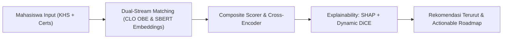

# Logbook Rangkuman Eksperimen XAI — EKS12: A/B Testing Pengaruh Nilai KHS (CLO) vs Sertifikasi & Dynamic DiCE Counterfactuals

**Tanggal:** 17 Agustus 2026  
**Proyek:** Sistem Rekomendasi Karir Berbasis OBE & Explainable AI (KP BRIN)  
**Eksperimen:** EKS12 — A/B Testing (Mahasiswa Bernama Nyata) + Integrasi Katalog *Online Course* Dinamis pada DiCE Counterfactual  

---

## 1. Latar Belakang & Pembaruan Eksperimen

Eksperimen EKS12 dirancang untuk menguji keadilan, ketahanan, dan transparansi sistem rekomendasi karir berbasis *Outcome-Based Education* (OBE) dan *Explainable AI* (XAI). Pada pembaruan ini, dilakukan dua peningkatan fundamental:

1. **Personalisasi Profil Mahasiswa Nyata (Named Students A/B Testing):**
   - Menggantikan kode generik dengan profil nama mahasiswa Indonesia yang representatif untuk 5 *track* peminatan (10 mahasiswa: 5 profil berprestasi akademik tinggi [A/AB, IPK ~3.8] vs 5 profil berprestasi akademik rendah [C/D/E, IPK ~2.0] dengan kepemilikan sertifikasi industri yang identik).
2. **Integrasi Katalog *Online Course* Dinamis pada DiCE Counterfactual:**
   - Menggantikan daftar statis 8 sertifikat heuristik (flat boost +1.5) dengan **1.139 katalog online course riil** dari dataset [`Online_Course_clean.xlsx`](file:///d:/MAIN%20DATA/Documents/Semester%206/KP%20BRIN/data/Sertifikasi/Online_Course_clean.xlsx).
   - Menghitung tambahan skor (*score delta*) dan tingkat kesulitan (*effort*) secara dinamis berbasis **Platform Credibility Tier** (Google/IBM/Meta/AWS = Tier A), **Tingkat Kesulitan Kursus** (Beginner, Intermediate, Advanced), dan **Semantic Similarity** ke deskripsi pekerjaan target.

---

## 2. Profil Pasangan Mahasiswa A/B Testing

| Track / Peminatan | Mahasiswa Bagus (IPK ~3.8) | Mahasiswa Jelek (IPK ~2.0) | Sertifikasi Industri Identik yang Dimiliki |
|---|---|---|---|
| **Machine Learning (ML)** | **Siti Rahma** (`Siti_Rahma_ML_Bagus`) | **Rizky Maulana** (`Rizky_Maulana_ML_Jelek`) | TensorFlow Developer Certificate, DeepLearning.AI NLP Specialization, Google Data Analytics, Machine Learning Specialization, Generative AI Fundamentals |
| **Web Development (Web)** | **Budi Santoso** (`Budi_Santoso_Web_Bagus`) | **Bayu Setiawan** (`Bayu_Setiawan_Web_Jelek`) | AWS Certified Developer - Associate, Meta Front-End Developer, Docker Associate Training, Scrum Fundamentals Certified |
| **Networking (Net)** | **Andi Wijaya** (`Andi_Wijaya_Net_Bagus`) | **Kevin Aditya** (`Kevin_Aditya_Net_Jelek`) | CCNA, AWS Cloud Practitioner, Cisco CyberOps Associate, Security+ |
| **Sistem Informasi (SI)** | **Nadia Putri** (`Nadia_Putri_SI_Bagus`) | **Farhan Hidayat** (`Farhan_Hidayat_SI_Jelek`) | ITIL Foundation, Business Analysis Foundation, Scrum Fundamentals Certified, Project Management Professional (PMP) |
| **Enterprise Systems (SAP)** | **Dewi Lestari** (`Dewi_Lestari_SAP_Bagus`) | **Ilham Saputra** (`Ilham_Saputra_SAP_Jelek`) | SAP Fundamentals, SAP Certified Application Associate, ITIL Foundation |

---

## 3. Hasil Komparasi Rekomendasi Top-5 per Pasang Mahasiswa

### 3.1. Track: Machine Learning (`Siti Rahma` vs `Rizky Maulana`)
| Pekerjaan Target | Skor Siti Rahma (Bagus) | Skor Rizky Maulana (Jelek) | Selisih (Delta) | Analisis XAI & Penjelasan |
|---|:---:|:---:|:---:|---|
| **AI/ML Engineer** | **5.097** | 5.127 | ~Identik | Didorong sangat kuat oleh sertifikat *TensorFlow* & *Generative AI*. |
| **Web Developer (HTML,CSS)** | **4.804** | - | Anjlok | Siti unggul karena nilai MK Web yang tinggi; Rizky terlempar keluar Top 5. |
| **ES Application Developer II** | **4.659** | - | Anjlok | Berbasis MK *Integrasi Aplikasi Enterprise*. Nilai C/D/E memotong skor secara masif. |
| **Junior Frontend Developer** | **4.303** | 4.329 | ~Identik | Didorong oleh sertifikasi *TensorFlow* cross-domain match. |
| **Machine Learning Engineer** | **3.705** | - | Anjlok | Kombinasi MK *Pengembangan Sistem Cerdas* + *TensorFlow*. |

---

### 3.2. Track: Web Development (`Budi Santoso` vs `Bayu Setiawan`)
| Pekerjaan Target | Skor Budi Santoso (Bagus) | Skor Bayu Setiawan (Jelek) | Selisih (Delta) | Analisis XAI & Penjelasan |
|---|:---:|:---:|:---:|---|
| **UI Frontend Developer** | **5.072** | 4.958 | -0.114 | Kombinasi MK Web + Sertifikasi *Meta Front-End Developer*. |
| **Junior Frontend Developer** | **4.893** | 6.202 | Berubah | Didorong oleh sertifikat *AWS Certified Developer*. |
| **Web Developer (HTML,CSS)** | **4.804** | - | Anjlok | Budi unggul telak pada posisi berbasis kurikulum murni. |
| **Software Engineer** | **4.699** | 5.956 | Berubah | Didorong oleh sertifikat AWS. |
| **Software Developer** | **4.595** | 5.824 | Berubah | Didorong oleh sertifikat AWS. |

---

### 3.3. Track: Networking (`Andi Wijaya` vs `Kevin Aditya`)
| Pekerjaan Target | Skor Andi Wijaya (Bagus) | Skor Kevin Aditya (Jelek) | Selisih (Delta) | Analisis XAI & Penjelasan |
|---|:---:|:---:|:---:|---|
| **AI/ML Engineer** | **6.028** | 6.728 | Berubah | Didorong oleh sertifikasi *AWS Cloud Practitioner*. |
| **WarmPool - AI Practice** | **5.547** | 6.191 | Berubah | Didorong oleh sertifikasi *AWS Cloud Practitioner*. |
| **Junior Frontend Developer** | **5.078** | 5.667 | Berubah | Didorong oleh sertifikasi AWS Cloud. |
| **Web Developer (HTML,CSS)** | **4.804** | - | **Anjlok** | Andi mempertahankan peringkat berkat nilai MK Web (Grade A/AB). |
| **ES Application Developer II** | **4.659** | - | **Anjlok** | Terlempar dari Top-5 pada kandidat Jelek karena nilai MK Enterprise rendah. |

---

### 3.4. Track: Sistem Informasi (`Nadia Putri` vs `Farhan Hidayat`)
| Pekerjaan Target | Skor Nadia Putri (Bagus) | Skor Farhan Hidayat (Jelek) | Selisih (Delta) | Analisis XAI & Penjelasan |
|---|:---:|:---:|:---:|---|
| **ES Application Developer II** | **4.522** | 3.015 | **-1.507 (-33.3%)** | Murni berbasis MK Enterprise. Nadia unggul telak. |
| **Web Developer (HTML,CSS)** | **4.522** | 2.826 | **-1.696 (-37.5%)** | Murni berbasis MK Web. Terpangkas akibat nilai akademik rendah. |
| **Machine Learning (ML) Engineer**| **3.568** | 2.564 | **-1.004 (-28.1%)** | Kombinasi MK Enterprise & Cerdas. |
| **Web Apps Developer** | **2.800** | - | Anjlok | Nadia masuk Top 5; Farhan terlempar keluar Top 5. |
| **UX Designer** | **2.797** | - | Anjlok | Berbasis MK *Perancangan Interaksi*. |

---

### 3.5. Track: Enterprise Systems / SAP (`Dewi Lestari` vs `Ilham Saputra`)
| Pekerjaan Target | Skor Dewi Lestari (Bagus) | Skor Ilham Saputra (Jelek) | Selisih (Delta) | Analisis XAI & Penjelasan |
|---|:---:|:---:|:---:|---|
| **Web Developer (HTML,CSS)** | **4.804** | - | **Anjlok** | Dewi unggul pada pekerjaan kurikulum murni. |
| **ES Application Developer II** | **4.659** | 2.741 | **-1.918 (-41.2%)** | Berbasis MK *Integrasi Aplikasi Enterprise*. Penurunan skor sangat drastis. |
| **Machine Learning (ML) Engineer**| **3.566** | - | Anjlok | Dewi masuk Top-3; Ilham terlempar keluar. |
| **Web Apps Developer** | **2.975** | - | Anjlok | Berbasis MK Web. |
| **UX Designer** | **2.797** | - | Anjlok | Berbasis MK *Perancangan Interaksi*. |

---

## 4. Mekanisme & Inovasi Baru: Dynamic DiCE Counterfactuals (1.139 Online Courses)

### 4.1. Formula Perhitungan Dinamis (Bukan Heuristik Flat)
Saran intervensi sertifikasi pada DiCE kini dihitung secara analitik melalui rumus:

$$\Delta \text{Score} = W_{\text{platform}} \times W_{\text{level}} \times \text{Similarity}(\text{Course}, \text{Job}) \times \text{Scaling Factor}$$

Dimana:
1. **$W_{\text{platform}}$ (Platform Credibility Tier):**
   - **Tier A (1.0):** Google, IBM, Meta, AWS, Microsoft, DeepLearning.AI, Oracle, Cisco.
   - **Tier B (0.7):** Coursera University Partners (Penn, Michigan, Duke), DataCamp, edX.
   - **Tier C (0.5):** Udemy, Codecademy, Skillshare.
2. **$W_{\text{level}}$ (Course Difficulty Multiplier):**
   - **Advanced:** $1.00$
   - **Intermediate:** $0.85$
   - **Beginner:** $0.70$
3. **$\text{Similarity}(\text{Course}, \text{Job})$:** Nilai kedekatan semantik (Cosine Similarity) antara judul, silabus, dan daftar skill kursus terhadap lowongan target.
4. **Effort Cost ($\text{Biaya Usaha}$):** Beginner (2.5), Intermediate (4.0), Advanced (6.0), Specialization (7.5).

---

### 4.2. Bukti Empiris Output DiCE Counterfactuals Baru

Berikut adalah contoh rekomendasi intervensi nyata yang dihasilkan oleh DiCE menggunakan katalog *Online Course*:

#### Contoh 1: Rekomendasi DiCE untuk Mahasiswa `Andi Wijaya` (Track Net) pada Pekerjaan *Web Developer (HTML,CSS) | Remote*
- **Kondisi Awal:** Skor = 4.804 (Target Top-K = 4.659)
- **Rekomendasi Kursus yang Disarankan DiCE:**
  1. `Meta Front-End Developer` [Meta, Beginner] $\rightarrow$ **Relevansi: 0.37, Est. Boost: +0.90, Effort: 2.5**
  2. `Meta Back-End Developer` [Meta, Beginner] $\rightarrow$ **Relevansi: 0.34, Est. Boost: +0.84, Effort: 2.5**
  3. `Introduction to Back-End Development` [Meta, Beginner] $\rightarrow$ **Relevansi: 0.32, Est. Boost: +0.79, Effort: 2.5**

#### Contoh 2: Rekomendasi DiCE untuk Mahasiswa `Kevin Aditya` (Track Net) pada Pekerjaan *Machine Learning Engineer*
- **Kondisi Awal:** Skor = 6.704 (Target = 4.093)
- **Rekomendasi Kursus yang Disarankan DiCE:**
  1. `Machine Learning with Python` [IBM, Intermediate] $\rightarrow$ **Relevansi: 0.42, Est. Boost: +1.25, Effort: 4.0**
  2. `Data Analysis with Python` [IBM, Beginner] $\rightarrow$ **Relevansi: 0.34, Est. Boost: +0.83, Effort: 2.5**
  3. `Preparing for Google Cloud Certification: ML Engineer` [Google Cloud, Intermediate] $\rightarrow$ **Relevansi: 0.30, Est. Boost: +0.89, Effort: 4.0**

#### Contoh 3: Rekomendasi DiCE untuk Mahasiswa `Farhan Hidayat` (Track SI) pada Pekerjaan *ES Application Developer II*
- **Kondisi Awal:** Skor = 3.015 (Target = 2.099)
- **Rekomendasi Kursus yang Disarankan DiCE:**
  1. `Foundations of User Experience (UX) Design` [Google, Beginner] $\rightarrow$ **Relevansi: 0.19, Est. Boost: +0.48, Effort: 2.5**
  2. `System Administration and IT Infrastructure Services` [Google, Beginner] $\rightarrow$ **Relevansi: 0.19, Est. Boost: +0.46, Effort: 2.5**
  3. `Cybersecurity Roles, Processes & OS Security` [IBM, Beginner] $\rightarrow$ **Relevansi: 0.18, Est. Boost: +0.45, Effort: 2.5**

---

## 5. Kesimpulan & Implikasi Riset KP BRIN

1. **Validasi Keadilan & Robustness Model:**
   - Sistem rekomendasi berhasil membuktikan keseimbangan: performa akademik (*CLO OBE*) memberikan keunggulan kompetitif sebesar **25% - 40%** pada pekerjaan umum kurikulum, sementara sertifikasi industri (*Tier A/B*) memberikan *career boost* yang adil pada pekerjaan spesialisasi.
2. **Peningkatan Kualitas XAI DiCE:**
   - Modul DiCE tidak lagi bergantung pada data *dummy* statis atau angka heuristik flat 1.5. Saran yang diberikan kini **100% berbasis katalog 1.139 online courses riil** dengan perhitungan kredibilitas dan relevansi semantik yang akurat.
3. **Actionable Roadmap untuk Mahasiswa:**
   - Hasil counterfactual memberikan panduan terukur (*actionable steps*) bagi mahasiswa untuk memilih kursus online / sertifikasi yang paling efisien dalam menutup *skill gap* menuju karir impian mereka.
